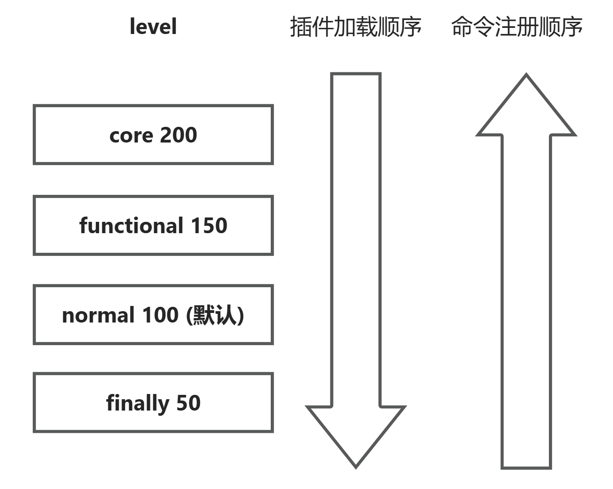
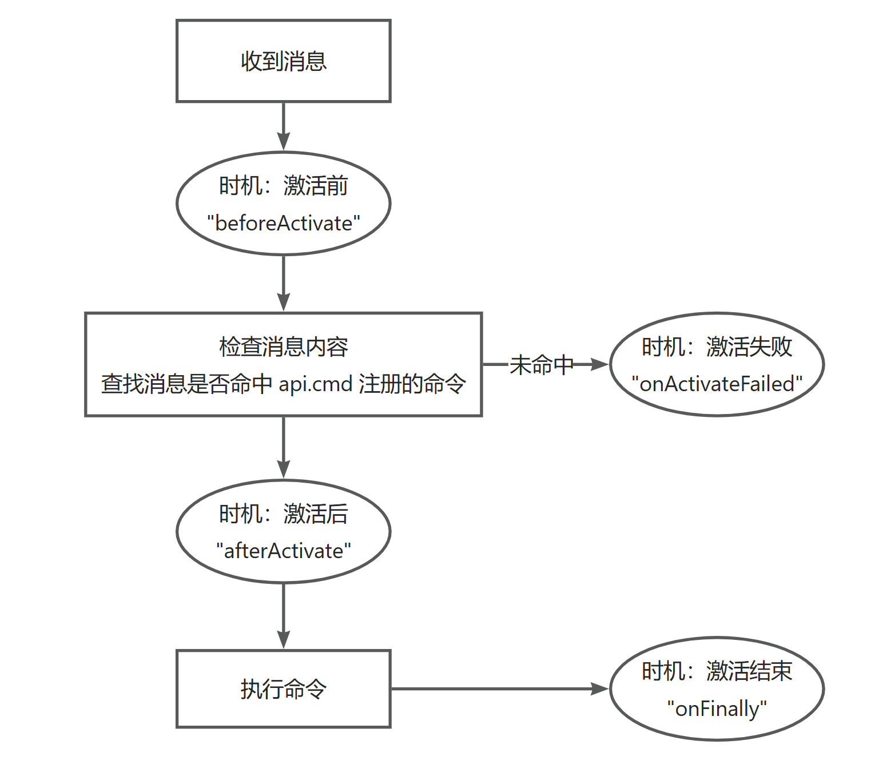

> 特别鸣谢： [初代枫林 QQ 机器人](https://github.com/liuqianpan2008/FengbotQQ)

# 插件文档

最简单的插件示范：

```js
//PLUGINX <- 这是插件识别前缀，用于识别和自动安装（必要）

export default {
    config: {
        id: "temp", // 你的插件 ID ，全局唯一标识（必要）
        name: "测试名称", // 你的插件名称（必要）
        author: "Sakulin" // 作者（必要）
    },
    setup() {
        // 插件初始化函数（必要）
    }
}
```

`config.id` 、 `config.name` 、 `config.author` 、 `setup` 这四个字段是必要字段，必须提供，否则机器人会拒绝安装。

直接将这段代码文件复制到机器人的私聊（如果代码不长、可以发送的话）进行安装，也可以将 js 代码文件上传到包含机器人的群聊进行安装。

## 插件 API

`PluginAPI` 是一个功能丰富的插件 API ，你能够通过它来实现很多功能。

你可以通过以下方式拿到 `PluginAPI` ：

```js
//PLUGINX

export default {
    config: { /* ... */ },
    setup(api) { // 通过 setup 函数的第一个参数来获取 PluginAPI
        api.log("Hello World!");
    }
}
```

## 快速开始（借助 `ContextHelper` 快捷编写机器人）

在 setup 函数中，你可以使用 `api.cmd(string[], function)` 来定义命令。

```js
//PLUGINX

export default {
    config: { /* ... */ },
    setup(api) {

        async function testCmd(ch, arg1, arg2 /*...*/) { // 第一个参数是 ContextHelper，后面的参数是命令参数
            // 这里是你的命令代码
        }

        // 定义命令
        api.cmd(["测试命令"], testCmd);
    }
}
```

这样以来，你就可以通过通过以下方式调用命令：
- **私聊** 通过给机器人发送 `测试命令` 来调用命令。
- **群聊** 通过给在群内发送 `@机器人 测试命令` 来调用命令。

你可以借助 `ch` 参数（`ContextHelper`）实现模拟机器人行为来生成回复，例如：

```js
// 正常调用
async function testCmd(ch) {

    ch.text("你好！"); // 输入文本 “你好”

    ch.face("ww"); // 输入表情 “汪汪”（狗头）

    await ch.go(); // 发送消息
}

// 链式调用
async function testCmd(ch) {
    await ch.text("你好！").face("ww").go();
}
```

你也可以在一次命令中发送多条信息。

```js

ch.text("你好，这是第一条信息");

await ch.go(); // 执行后，虚拟输入框会清空

ch.text("你好，这是第二条信息");

await ch.go();

```

### `ContextHelper` 的高级功能

你可以通过 `ch.userId` 或 `ch.user_id` 来获取发送这个命令的用户 QQ 号。

```js
await ch.text(`你好，${ch.userId}`).go();

// 注意，ch.userId 和 ch.user_id 得到的QQ号是一个数字，而不是字符串。
```

你可以通过 `ch.isGroup` 来获取当前的上下文类型。

```js
if (ch.isGroup) {

    /* 群聊逻辑 */

} else {

    /* 私聊逻辑 */

}
```

当处于群聊时，你可以通过 `ch.groupId` 或 `ch.group_id` 来获取当前群聊的群号。

```js
if (ch.isGroup) {

    const groupId = ch.groupId;

    /* 其他逻辑 */

}
```

处于群聊时，你可以通过 `ch.at()` 来艾特其他人。如果不在群聊，这个方法不会产生任何作用。

```js
// 群聊环境

ch.at(); // 不提供参数时，会艾特发送者

// ch.at(123456789); 提供QQ号时，会艾特指定的QQ号的群友（如果在群里）

ch.text("你好，这是一条艾特消息");

await ch.go(); // @发送者 你好，这是一条艾特消息
```

你可以使用完成封装的 `ch.goAutoReply()` 来自动回复信息。

```js
await ch.text("你好！").goAutoReply();

// 群聊环境： 回复[发送者]: 你好！
// 私聊环境： 你好！
```

### 使用 Napcat 模块（高阶操作）

你可以通过 `ch.context` 来获取 Napcat 提供的原始上下文对象；使用 `ch.napcat` 获取 `NCWebsocket` 对象，以此实现更多功能。

## 高级功能与概念

> **章节简述**
>
> 根据你的需求快速定位章节：
>
> - **快捷命令**：你可以直接通过你定义的方法名来调用命令，而无需显式声明插件id。
> - **持久化存储**：你可以通过 `api.store` 对象来实现持久化存储，在机器人重启、更新，或插件重载时保存数据。
> - **定时任务**：你可以通过 `api.schedule` 对象来实现定时任务，使用 `cron` 表达式指定时间点执行任务。
> - **超级命令**：你可以定义一种特殊的命令，该命令在任何情况下被调用，而不管当前的上下文类型或是否被激活。
> - **插件通信、成员暴露与访问**：访问工具插件，或者创建一系列插件集并让它们互相协作，共同完成复杂目标。

### 快捷命令

正常的命令调用方式是冗长的，例如对于如下插件定义的 `测试命令` 。

```js
//PLUGINX

export default {
    config: {id: "temp", /* 其他必要属性 */},
    setup(api) {
        api.cmd(["测试命令"], (ch) => {
            /* ... */
        });
    }
}
```

插件命令的显式调用方式的消息是这样的：`@机器人 $temp 测试命令`（群聊）

而快捷命令的机制让你无需显式声明插件id，而是直接通过方法名访问命令： `@机器人 测试命令`

插件用 `api.cmd` 定义命令时，快捷命令选项是默认开启的。

> **命令重名处理机制**
>
> 参照组件成员暴露、访问机制的插件等级加载图，里面包含了命令的注册顺序图示。
>
> 
>
> 也就是说，当命令重名时，加载器会优先为等级较低的插件注册快捷命令。
>
> *当然，如果跟你竞争的插件跟你的插件处于相同等级时，那快捷命令的注册就要拼运气了(Doge)*

如果你不希望你的命令被注册为快捷命令，只需在注册的时候稍加配置即可：

```js
api.cmd(["测试命令"], fn, {
    quickCommandRegisterIgnore: true // 配置后，你只能使用显式调用方式来调用命令（@机器人 $temp 测试命令）
});
```

### 持久化存储

`PluginAPI` 提供了 `api.store` 对象来实现持久化存储。

```js
const store = api.store;

const data = await store.get("data", {}); // 获取数据，第二个参数为默认值，如果不存在则返回默认值。

await store.set("data", { key: "value" }); // 设置数据。
```

> 需要注意，底层存储方式为 Node 原生 JSON ，所以你需要保证存储的数据能够通过 `JSON.stringify` 方法序列化，并通过 `JSON.parse` 反序列化。


### 定时任务

`PluginAPI` 提供了 `api.schedule` 对象来实现定时任务。

```js
const schedule = api.schedule;

// 创建一个每天 0 点执行的定时任务
let job = schedule.create("0 0 0 * * *", () => {

    const bh = api.createBot(); // BotHelper 实例，跟 ContextHelper 类似，但是没有上下文信息。
    
    bh.openGroup(123456789); // 打开群聊
    bh.text("今天是星期" + new Date().getDay()); // 输入信息
    await bh.go(); // 发送消息

}); // 返回一个 ScheduleJob 对象，可以通过它来操作定时任务。

schedule.remove(job); // 取消定时任务
```

### 超级命令

超级命令是一种特殊的命令，它可以在任何情况下被调用，而不管当前的上下文类型或是否被激活。

你可以把它当成一个拦截器，可以在一个消息接收的任何时间点拦截，默默处理一点事情或者直接取消后面的逻辑。

拦截时机如下：

- `"beforeActivate"` ：消息接收后、命令识别前。
- `"onActivateFailed"` ：命令识别失败后。
- `"afterActivate"` ：命令识别成功后、命令代码执行前。
- `"onFinally"` ：命令代码执行后。

具体流程图如下：



示范：默默保存群聊历史记录

```js
//PLUGINX

export default {
    config: { /* ... */ },
    setup(api) {
        const store = api.store;

        async function saveHistory(ch) {
            const groupId = ch.groupId;
            const message = ch.getPureMessage(false);
            const history = await store.get(`history:${groupId}`, []);
            history.push(message);
            await store.set(`history:${groupId}`, history);

            return true; // 允许后面的逻辑执行
        }

        api.super(saveHistory, {
            time: "beforeActivate" // 拦截时机
        });
    }
}

```

> **2025.05.28 新增**
>
> 新增了 `"onGo"` 时机，用于拦截命令识别失败后。
>
> 该时机在插件发送消息后执行，这个超级命令中，回调方法的第二个参数能拿到 `Message[]` 消息数组，你可以通过它来获取机器人发送的消息。
>
> 注意：第一个参数除了 `ContextHelper` 之外，还可能拿到 `BotHelper` 实例，你需要在写函数时进行判断。
>
> 此外，该时机返回的 `boolean` 值无法控制后面的逻辑是否执行，因为插件发送消息后，后面的逻辑已经执行了，因此返回值会被忽略。
>
> ***警告***：不要在 `onGo` 时机控制机器人发送消息，否则会导致死循环。


### 插件通信、成员暴露与访问

#### 插件通信

`PluginAPI` 提供了 `api.listen` 和 `api.send` 方法来实现插件通信。

```js
// 插件 A setup 函数

api.listen("TEST_SIGNAL", (data) => {
    console.log(data); // 输出：Hello World!
});

// 插件 B setup 函数

api.send("TEST_SIGNAL", "Hello World!");
```

#### 成员暴露与访问

`PluginAPI` 提供了 `api.expose` 方法来暴露插件成员。

```js
//PLUGINX

export default {
    config: { /* ... */ },
    setup(api) {

        function myMethod() {
            // 实现一些独有功能
        }

        api.expose({ myMethod }); // 暴露组件成员
    }
}
```

通过 `api.outside` 委托对象可以访问其他插件的组件成员。

```js
//PLUGINX

export default {
    config: { /* ... */ },
    setup(api) {
        async function myCmd(ch) {
            const hasPermission = await api.outside.util.hasPermission(ch.userId);

            /* ... */
        }

        // [警告]请不要像下面这样做！
        const util = api.outside.util;
        // 为什么：如 util 插件更新，你手上的 util 对象可能指向已经被删除的对象。
        // 访问 outside 的成员时，请即拿即用，不要保存引用。
    }
}
```

如果你的插件强依赖于其他插件，可运行 `api.assert` 方法来确保其他插件已安装，也可以用 `api.reject` 方法来在合适的时间阻止自己的安装。

```js
//PLUGINX

export default {
    config: { /* ... */ },
    setup(api) {
        if (!api.assert("util")) {
            api.reject("本插件依赖于 Util 插件运行"); // 阻止自己的安装
            return;
        }

        /* ... */
    }
}
```

需要注意的是，如果你强依赖于其他插件，必须保证你的插件在其他插件之后安装。

通过设置 `config` 的可选参数 `level` 来控制插件安装顺序，插件加载器的具体加载顺序如下：


例如：对于下面两个插件

```js
//PLUGINX

export default {
    config: {
        id: "a",
        name: "插件 A",
        author: "Sakulin",
        level: "functional" // functional 对应值 150
    },
    setup(api) {
        api.log("加载插件 A！");
        api.log(api.assert("b"));
    }
}
```

```js
//PLUGINX

export default {
    config: {
        id: "b",
        name: "插件 B",
        author: "Sakulin",
        level: 120 // 显式定义插件等级
    },
    setup(api) {
        api.log("加载插件 B！");
        api.log(api.assert("a"));
    }
}
```

插件 B 会在插件 A 之后加载，输出如下：

```
加载插件 A！
false
加载插件 B！
true
```

